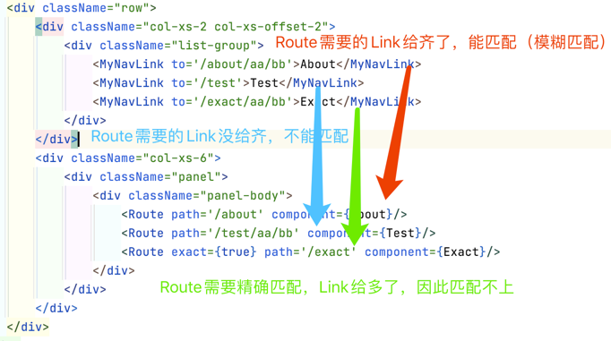

## 14_前端路由（模糊匹配、严格匹配）

```aidl
1.Route默认为模糊匹配，即Route需要的，Link需给到位，可以多给，不能少给，且顺序要一致，否则匹配不上；
2.通过设置exact={true}开启精确匹配，即Link给的path与Route所需的必须一模一样，才能匹配；
3.通常不提倡开启精确匹配，尤以在使用二级路由时，会出现问题，只有在模糊匹配出现问题时，才考虑使用精确匹配。
```