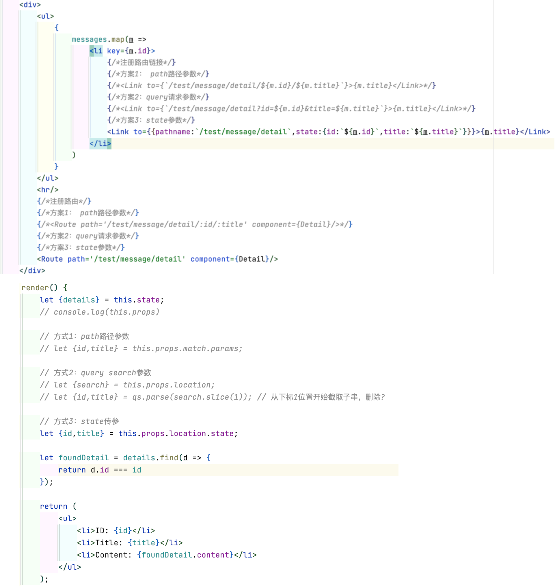

## 19_传递路由参数（state参数）

```aidl
前端路由传参方式：
方案1： params 参数 （使用较多）
    路由链接 <Link to=`/a/b/${id}/${name}`>{info}</Link>
    路由 <Route path='/a/b/:id/:title' component={Detail}/>
    接收参数 let {id,name} = this.props.match.params;

方案2： search参数
    路由链接 <Link to=`/a/b?id=${id}&name=${name}`>{info}</Link>
    路由 <Route path='/a/b' component={Detail}/>
    接收参数 
        import qs from 'querystring'
        let {search} = this.props.location.search;
        let {id,name} = qs.parse(search.slice(1))p

方案3：state参数 可以隐式传参
    路由参数 <Link to={{pathname:'/a/b',state:{id:`${id}`,name:`${name}`}}}>{info}</Link>
    路由 <Route path='/a/b' component={Detail}/>
    接收参数 let {id,name} = this.props.location.state; 

```