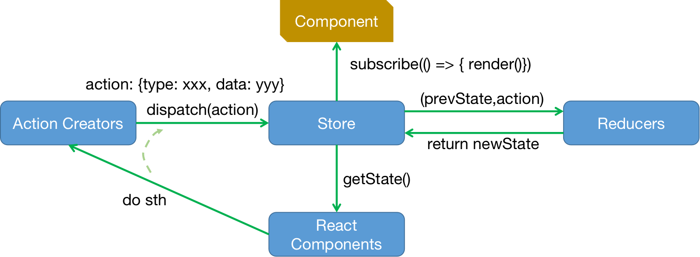

## 26_累计求和（Redux精简版）

```aidl
Redux：存储共享状态的第三方组件，适合存储公共状态、以及嵌套比较深的组件之间相互通信，执行Angular、Vue、React；
Vue专门存储共享状态组件Vuex;


yarn add redux

Redux组成：
1.Reducers 自定义进行累加、累减操作，实质是一个函数 function reduce(prevState,action) return newState;
2.Store 存储共享状态，使用redux的 createStore函数创建，传入上面的reduce函数，初始化过程由redux调用，之后只需要向Store调用dispatch(action)下发操作；
import {createStore} from 'redux'
3.下发action的操作，可以由 React Component 直接调用，也可以由Action Creators 调用；
4.被redux组件维护的公共状态，可以通过getState()函数获取；
5.共享状态更新后，通过调用subscribe()感知，并在其中触发render,完成组件重新渲染

 


```