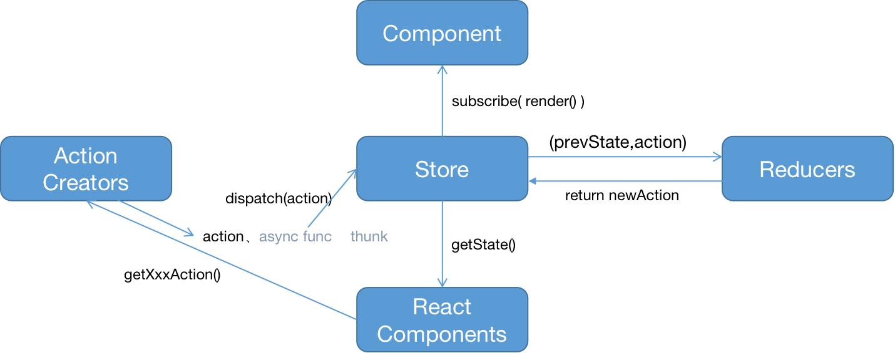

## 28_Redux异步Action

```aidl
1.count_reducer.js 创建reducer函数，接收prevState、action，返回newState，有store调用；
2.store.js 借助redux的createStore，传入reducer函数，store.dispatch() 默认参数为action对象，如果需要接收异步函数，然后在函数中下发action，需要借助thunk;
3.action_creators.js 创建一般js对象，执行同步action，或创建返回函数对象的高阶函数，在函数体内异步下发action;
4.constant.js 封装INCREMENT、DECREMENT等不同信号；
5.index.js store数据变更，需要借助消息订阅发布机制，触发组件重新渲染；

store.getState() 获取共享数据
store.dispatch(action) 下发一般js对象，执行同步action
store.dispatch(async func)下发异步函数，函数体内执行异步任务，并下发js对象，执行异步action；
store.subscribe(render func) 借助subscribe 及时感知数据变更，并触发重新渲染

注：redux的store的dispatch只会接收一般js对象，执行同步action，如果需要实现异步action效果，可以在Components中执行setTimeout等待，然后执行同步action，或直接下发异步函数，
在异步函数中下发同步action，但此异步函数调用需要借助 redux的applyMiddleware()，和 thunk 模块实现
yarn add thunk, redux

import {createStore,applyMiddleware} from 'redux';
import thunk from 'thunk'; 
createStore(xxxReducer,applyMiddleware(thunk))

```