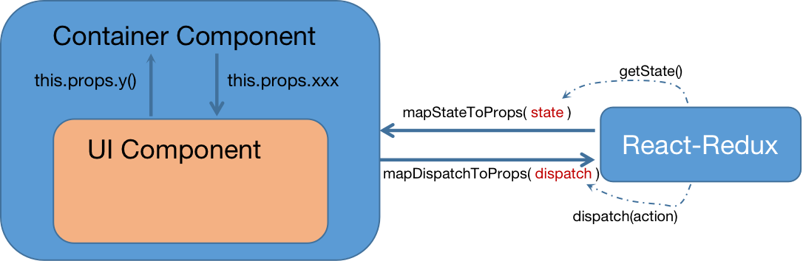

## 31_react-redux（使用Provider）

```aidl
react-redux 是react官方维护的redux库，可以很好将react代码与redux模块融合。
特点：
   1.react组件分为容器组件和UI组件，容器组件包裹UI组件，UI不直接与react-redux发生联系，通过容器组件实现间接访问；
   2.依旧正常创建reducer 函数，并基于此创建store；
   3.容器组件内部从react-redux中引入connect()()柯里化函数，第二次调用传入UI组件，第一次调用传入mapStateToProps(state)、
   mapDispatchToProps(dispatch)两个函数，分别返回发kv形式js对象，对应获取store中的存储的状态，以及操作状态的函数；
   4.容器组件无需自己传入store,而是在index.js中，App外层包裹Provider，将store传给Prodivder，其中的容器组件就可自动获取store;
   5.使用react-redux无需自己在index.js中，同subscribe手动监测state修改，触发重新渲染，connect()()已经使容器组件具备自动监测渲染能力
   
yarn add 'react-redux'

注：mapDispatchToProps 既可以是一个函数，又可以是一个js对象，对象value 为可以action实例的函数，或接受dispatch，的异步函数，
由react-redux调用dispatch进行分发，或调用异步函数，然后分发action；


```
> mapDispatchToProps 一般写法：自己调用dispatch
```aidl
// 同步store的状态给UI组件
const mapStateToProps = (state) => {
    return {count:state}
}

// 同步操作store状态的函数给UI组件
const mapDispatchToProps = (dispatch) => {
    return {
        handleIncrement: (data) => dispatch(createIncrementAction(data)),
        handleDecrement: (data) => dispatch(createDecrementAction(data)),
        handleIncrementAsync: () => dispatch(createIncrementActionAsync()),
    }
}

export default connect(mapStateToProps,mapDispatchToProps)(CountUI)
```
> mapDispatchToProps 简略写法：返回action或异步函数，由react-redux调用dispatch和异步函数
```aidl
// mapDispatchToProps 简略写法：返回action或异步函数，由react-redux调用dispatch和异步函数
export default connect(
    state => ({count:state}),
     {// mapDispatchToProps 既可以是一个函数，又可以是一个js对象，对象value 为可以action实例的函数，或接受dispatch，的异步函数，
         // 由react-redux调用dispatch进行分发，或调用异步函数，然后分发action
        handleIncrement: createIncrementAction,
        handleDecrement: createDecrementAction,
        handleIncrementAsync: createIncrementActionAsync,
    }
)(CountUI)
```