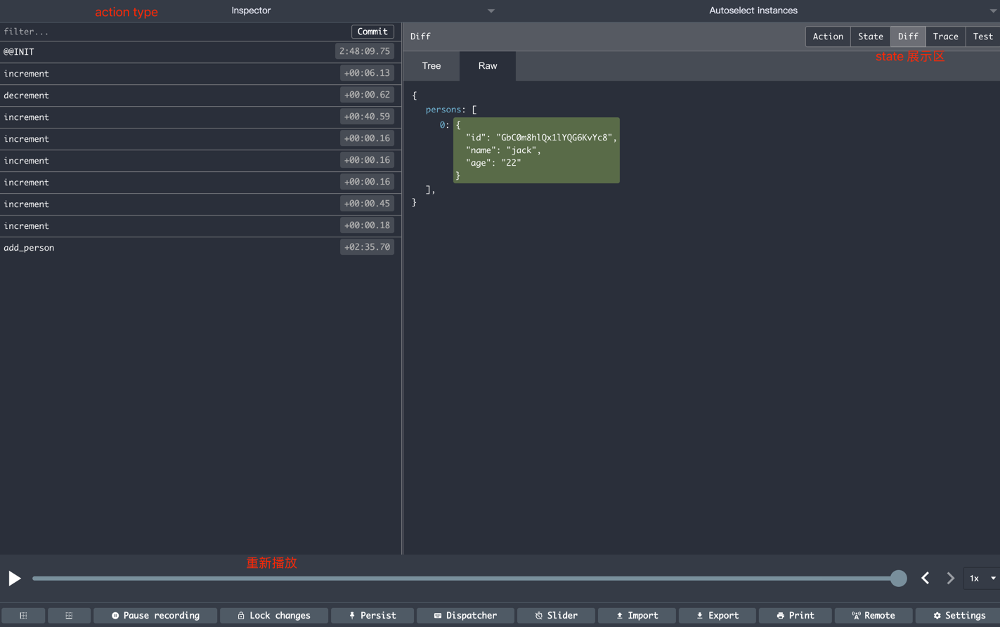

## 34_redux开发者工具

```aidl
使用 redux 开发者工具，可以直观展示每一步调用过程；
1.安装浏览器插件 redux 
2.安装依赖 yarn add redux-devtools-extension
3.store 中使用依赖
   import {ComposeWithDevTools} from 'redux-devtools-extensions'
   createStore(allReducers,ComposeWithDevTools(applyMiddleware(thunk)))
```