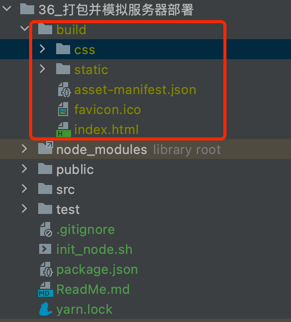
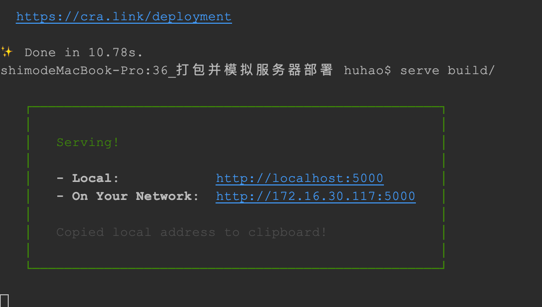

## 36_打包并模拟服务器部署

```aidl
打包后生成 build输出文件
yarn build
```



```aidl
借助 serve 将制定目录作为服务器目录，部署项目

1.安装依赖：yarn global add serve
2. serve -s 指定目录

eg: serve -s build

```


> 注：浏览器 React Developer Tool 工具显示蓝色高亮状态，即表明当前是线上环境，部署开发环境。
