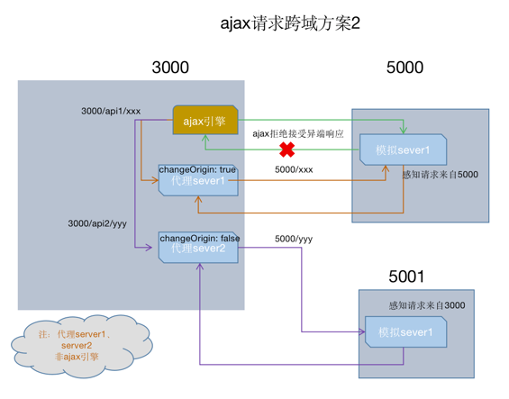

## 代理机制（二）
```aidl
1.src目录编写 setupProxy.js文件，使用Commonjs 编写代理服务器，为各自代理链路设置好路径标识，并开启changeOrigin 修改请求头中host、pathRewrite 路径重写；
2.项目中请求请求自身地址，但路径混入代理标识；
3.重启服务 yarn start;
4.多头代理核心是为各自代理路径配置不同解析逻辑，请求时还是优先查找本机资源，为找到再逐一询问代理服务
```
